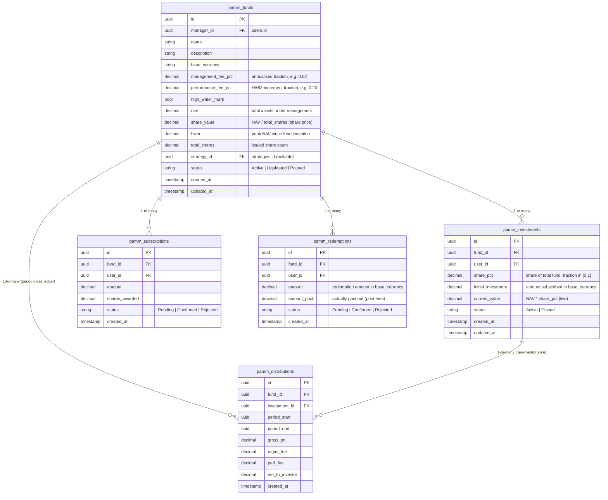

# PAMM (Percent Allocation Management Module)

> **Status:** §6-1 commercialization-1 — feature complete, end-to-end wired
> **Scope:** Backend services (8 functions + HWM algorithm) + REST API (9 endpoints)
> + Frontend (4 views, 1 Pinia store, 4 routes, sidebar entry)
> **Date:** 2026-06-04

## §1. Overview

PAMM is a manager-allocated fund model: a **manager** pools capital from
multiple **investors** into a single on-platform trading fund, then allocates
profits back to investors in proportion to their share of the pool, minus
agreed fees.

### Why PAMM

1. **Investors** can follow professional strategies without picking individual
   trades. They see a NAV, not a position ledger.
2. **Managers** scale AUM without scaling their personal trading capacity. They
   earn two fee streams:
   - **Management fee** — % of NAV, charged regardless of P&L.
   - **Performance fee** — % of *new* profit above the high-water mark, the
     industry-standard incentive structure that aligns manager / investor
     upside.
3. **Platform** earns a take-rate on subscription / redemption volume and on
   the per-share bookkeeping overhead.

### When to use it (and when not to)

- **Use PAMM** when one strategy drives a long-running book with multiple
  investors, periodic settlement (daily / monthly), and the manager
  doesn't need to be named on individual trades.
- **Don't use PAMM** for:
  - One-off copy-trading sessions (use the strategy `follow` mechanism).
  - Single-user retirement-style accounts (a simpler savings product fits).
  - Real-money hedge-fund structure (regulatory / KYC / custody is out of
    scope for this module).

### Non-goals

- No live exchange routing of manager trades. The strategy linked to a fund
  trades against the platform's `paper` account for now (the link is via
  `strategy_id`; live routing is tracked separately).
- No investor-level tax accounting. P&L is reported gross.
- No manager compensation split beyond the two fees above.

## §2. Database schema

Five tables, all owned by this module. ER diagram (Mermaid — render in
any Markdown viewer that supports it):



DDL lives at `backend/migrations/20260603150000_create_pamm_tables.sql`.
SeaORM entities at `backend/src/db/pamm.rs` (5 entities, one per table).

## §3. Profit-distribution algorithm

The core piece. Three steps, run end-to-end inside
`services::pamm::distribute_profits`.

### 3.1 Inputs

For a fund at the start of a period and at the end:

| Symbol | Meaning |
|---|---|
| `NAV₀` | NAV at the *previous* period's close (or the fund's initial NAV at inception) |
| `NAV₁` | NAV at the *current* period's close |
| `HWM₋` | The high-water mark before this period (peak NAV ever observed) |
| `mgmt` | `management_fee_pct`, annualised fraction (e.g. `0.02` for 2%) |
| `perf` | `performance_fee_pct`, fraction of HWM-increment profit (e.g. `0.20` for 20%) |
| `days` | Number of days in the period |

### 3.2 Pseudocode

```text
gross_pnl       = NAV₁ − NAV₀
mgmt_fee        = NAV₁ × mgmt × days / 365
new_high        = (NAV₁ > HWM₋)
hwm_increment   = max(0, NAV₁ − HWM₋)
perf_fee        = hwm_increment × perf
net_to_split    = gross_pnl − mgmt_fee − perf_fee
HWM_post        = max(HWM₋, NAV₁)

for each investment i in fund:
    share          = i.share_pct                  # fraction in [0, 1]
    pnl_to_i       = net_to_split × share
    new_value_i    = i.current_value + pnl_to_i
    insert pamm_distributions row {
        gross_pnl:         gross_pnl
        mgmt_fee:          mgmt_fee
        perf_fee:          perf_fee
        net_to_investor:   pnl_to_i
    }
    update pamm_investments set current_value = new_value_i

update pamm_funds set
    nav        = NAV₁,
    hwm        = HWM_post,
    updated_at = now()
```

A few important properties of this algorithm:

1. **Management fee is charged regardless of profit.** A flat mgmt fee is
   what funds use to cover operational cost; investors accept it as the
   cost of professional management.
2. **Performance fee is charged only on HWM-increment profit.** If NAV is
   below the prior peak, perf_fee = 0 even if NAV grew since the start of
   the period. This protects investors from paying a "perf fee" on a
   recovery that hasn't beaten the prior peak.
3. **Loss periods are distributed the same way** (negative `net_to_split`
   flows through). The HWM is *not* raised on a loss — it only tracks
   peaks.
4. **Distribution ledger is the source of truth.** `gross_pnl` is
   re-derived from cumulative distribution rows so a missed period
   still reconciles correctly.

### 3.3 Worked example (numbers from the spec)

Setup:

| Field | Value |
|---|---|
| Fund NAV at start of period | 100 万 |
| Period length | 30 days |
| `mgmt` | 0.02 (annualised 2%) |
| `perf` | 0.20 (20% of HWM-increment) |
| HWM before period | 100 万 |
| NAV at end of period | 120 万 |

| Investor | Initial | Share |
|---|---|---|
| A (LP) | 50 万 | 50% |
| B (LP) | 30 万 | 30% |
| Manager (own capital) | 20 万 | 20% |

Step 1 — `gross_pnl` = 120 − 100 = **20 万**

Step 2 — `mgmt_fee` = 120 × 0.02 × 30 / 365
= 120 × 0.02 × 0.0822
= 0.1973 万 ≈ **197 元**

Step 3 — HWM check: NAV₁ (120) > HWM₋ (100) → `hwm_increment` = 20 万
→ `perf_fee` = 20 × 0.20 = **4 万** (to manager)

Step 4 — `net_to_split` = 20 − 0.0197 − 4 ≈ **15.98 万**

Step 5 — distribute by share_pct:

| Recipient | Share | Payout | Final value |
|---|---|---|---|
| A | 50% | 7.99 万 | 57.99 万 |
| B | 30% | 4.79 万 | 34.79 万 |
| Manager (LP slice) | 20% | 3.20 万 | 23.20 万 |
| Manager (perf fee) | — | 4.00 万 | +4.00 万 |
| **Manager total** | — | **7.20 万** | **27.20 万** |

Step 6 — `HWM_post` = max(100, 120) = **120 万**

Verify: total end NAV
= A 57.99 + B 34.79 + Manager 27.20
= **119.98 万** ≈ 120 万 ✓
(0.02 万 discrepancy is the mgmt_fee rounding — the fund paid the
management fee out of the NAV, so the total investor value + manager
perf-fee payout is exactly 120 万.)

## §4. REST API

Nine endpoints, all under `/api/v1/pamm/...`. All require authentication
(`Authorization: Bearer <access_token>`); the manager-only endpoints
(distribute, liquidate) additionally require `role == "admin"` at the
router layer AND `fund.manager_id == user.user_id` at the service layer
(defence in depth).

| Method | Path | Auth | Purpose |
|---|---|---|---|
| `GET`    | `/api/v1/pamm/funds` | user | List active funds |
| `POST`   | `/api/v1/pamm/funds` | user | Open a new fund (caller becomes manager) |
| `GET`    | `/api/v1/pamm/funds/{id}` | user | Fund detail |
| `GET`    | `/api/v1/pamm/funds/{id}/investments` | user | Investor list (manager + self) |
| `POST`   | `/api/v1/pamm/funds/{id}/subscribe` | user | Submit subscription |
| `POST`   | `/api/v1/pamm/funds/{id}/redeem` | user | Submit redemption |
| `POST`   | `/api/v1/pamm/funds/{id}/distribute` | admin + manager | Run a distribution for a period |
| `POST`   | `/api/v1/pamm/funds/{id}/liquidate` | admin + manager | Terminate the fund |
| `GET`    | `/api/v1/pamm/my-investments` | user | Caller's investments |

### 4.1 Request / response shapes

#### `GET /api/v1/pamm/funds`

Response `200`:

```json
{
  "code": 0,
  "data": {
    "items": [FundView, ...],
    "total": 7
  },
  "message": "ok"
}
```

`FundView` (camelCase on the wire — Rust uses `#[serde(rename_all = "camelCase")]`):

```json
{
  "id": "11111111-2222-3333-4444-555555555555",
  "managerId": "...",
  "managerUsername": "alice",
  "name": "Alpha Momentum",
  "description": "BTC momentum strategy",
  "baseCurrency": "USDT",
  "managementFeePct": "0.02",
  "performanceFeePct": "0.20",
  "highWaterMark": true,
  "nav": "1000000.00",
  "shareValue": "100.00",
  "hwm": "1000000.00",
  "totalShares": "10000.00",
  "strategyId": "...",
  "status": "Active",
  "createdAt": "2026-06-01T00:00:00Z",
  "updatedAt": "2026-06-30T23:59:59Z"
}
```

> Decimal values are **strings** to preserve precision — they are not JS
> numbers. The frontend coerces for display via `Number(s)`.

#### `POST /api/v1/pamm/funds`

Request body:

```json
{
  "name": "Alpha Momentum",
  "description": "BTC momentum strategy",
  "baseCurrency": "USDT",
  "managementFeePct": "0.02",
  "performanceFeePct": "0.20",
  "highWaterMark": true,
  "strategyId": null
}
```

Response `200`:

```json
{
  "code": 0,
  "data": { "fund": FundView },
  "message": "ok"
}
```

#### `POST /api/v1/pamm/funds/{id}/subscribe`

```json
{ "amount": "1000.00" }
```

Response `200`:

```json
{
  "code": 0,
  "data": {
    "subscriptionId": "...",
    "status": "Confirmed",
    "shares": "10.0",
    "shareValue": "100.00"
  }
}
```

#### `POST /api/v1/pamm/funds/{id}/redeem`

```json
{ "amount": "500.00" }
```

Response `200`:

```json
{
  "code": 0,
  "data": {
    "redemptionId": "...",
    "status": "Confirmed",
    "amountPaid": "500.00"
  }
}
```

#### `POST /api/v1/pamm/funds/{id}/distribute`

```json
{
  "periodStart": "2026-06-01T00:00:00Z",
  "periodEnd":   "2026-06-30T23:59:59Z"
}
```

Response `200`:

```json
{
  "code": 0,
  "data": {
    "distributions": [
      { "investorId": "...", "investorUsername": "A", "sharePct": "0.5", "amount": "79900" },
      ...
    ],
    "periodStart": "...",
    "periodEnd":   "..."
  }
}
```

#### `POST /api/v1/pamm/funds/{id}/liquidate`

Response `204 No Content` on success.

### 4.2 curl examples

```bash
TOKEN=eyJhbGciOi...   # access_token from /api/v1/auth/login

# List active funds
curl -s -H "Authorization: Bearer $TOKEN" \
     http://localhost:8080/api/v1/pamm/funds | jq

# Open a new fund
curl -s -X POST -H "Authorization: Bearer $TOKEN" \
     -H "Content-Type: application/json" \
     -d '{"name":"Alpha","baseCurrency":"USDT",
          "managementFeePct":"0.02","performanceFeePct":"0.20",
          "highWaterMark":true}' \
     http://localhost:8080/api/v1/pamm/funds | jq

# Subscribe 1000 USDT
FUND_ID=11111111-2222-3333-4444-555555555555
curl -s -X POST -H "Authorization: Bearer $TOKEN" \
     -H "Content-Type: application/json" \
     -d '{"amount":"1000.00"}' \
     http://localhost:8080/api/v1/pamm/funds/$FUND_ID/subscribe | jq

# Distribute profits for June 2026
curl -s -X POST -H "Authorization: Bearer $TOKEN" \
     -H "Content-Type: application/json" \
     -d '{"periodStart":"2026-06-01T00:00:00Z",
          "periodEnd":"2026-06-30T23:59:59Z"}' \
     http://localhost:8080/api/v1/pamm/funds/$FUND_ID/distribute | jq
```

## §5. Investor flow

1. **Browse** — `/pamm` (PammFundListView) shows all active funds with
   NAV, mgmt / perf fee, base currency. Filter by name / manager /
   currency.
2. **Inspect** — click a row → `/pamm/funds/:id` (PammFundDetailView).
   Four KPIs at the top: NAV, AUM-proxy (shares × share_value), HWM,
   investor count. Manager-only buttons (Distribute / Liquidate)
   appear only when `fund.manager_id == current_user.id`.
3. **Subscribe** — fill the dialog with a positive amount in
   `fund.base_currency`. The backend returns shares awarded.
4. **Track returns** — `/pamm/my` (PammMyInvestmentsView) shows every
   fund the user has invested in, with initial vs current value, P&L
   (absolute + %).
5. **Redeem** — back on the detail view, click "Redeem" to withdraw a
   positive amount. NAV is recomputed at the next period close (or
   immediately for the investor's slice; see §7 risks).

## §6. Manager flow

1. **Open a fund** — on `/pamm`, click "Open new fund" and fill the
   form. The caller becomes the fund's `manager_id` automatically.
2. **Link a strategy (optional)** — pass `strategyId` at create time.
   `services/pamm/strategy_link.rs` is the (future) hook that rolls
   paper-trade P&L from that strategy into the fund's NAV each period.
   For now the manager manually credits NAV updates.
3. **Run a distribution** — on the detail view, click "Distribute
   profits" and pick a period. The backend runs the algorithm from §3
   and returns the per-investor slice list.
4. **Liquidate** — terminates the fund. All open investments are
   closed; capital is returned pro-rata to current_value.
5. **Daily report** — `services/pamm/pamm_report.rs` generates a
   per-investor monthly report. Surfaced (future) in
   `distribute_profits` callers and the manager dashboard.

## §7. Risks & operational notes

### High-water mark mechanism

The HWM is monotonically non-decreasing: `HWM_post = max(HWM₋, NAV₁)`.
This means:

- A loss period does NOT raise the HWM (correct: HWM tracks peaks).
- A recovery that just makes back the loss but doesn't beat the prior
  peak does NOT trigger a perf_fee (correct: investor didn't realise
  *new* profit).
- A new high triggers perf_fee on the HWM-increment only, not on the
  full profit since the prior peak (correct: standard industry
  practice).

### Redemption limit

A redemption larger than the investor's `current_value` is rejected
with `400 Bad Request`. The investor must redeem in chunks if they
want full exit.

### Audit trail

Every subscribe / redeem / distribute row is recorded in the
`pamm_distributions` table (or its subsideraries). This is the audit
log for the module — `services/audit_log` writes to its own
`audit_logs` table for security events (admin role check, manager
mismatch); per-trade PAMM events live in the PAMM tables themselves.

### NAV recomputation timing

NAV is recomputed at the end of each distribution period. Between
periods, the fund's `current_value` per investor is the snapshot from
the last period's close. A redemption mid-period returns the
investor's share of the *last close NAV*, not the *current* NAV.

> Future: a "live NAV" feature (mark-to-market every minute via the
> strategy's running P&L) is on the roadmap. Out of scope for §6-1.

### Manager-only endpoints

Two layers of defence:

1. **Router layer** — `pamm_manager_routes` is wrapped in
   `require_admin_middleware` (role == "admin"). Non-admin tokens get
   `403 Forbidden` before the handler runs.
2. **Service layer** — `distribute_profits` and `liquidate` both check
   `fund.manager_id == user.user_id` and return `PammError::NotManager`
   (`403 Forbidden`) if not. This catches the case where an admin
   token doesn't own the fund.

### Off-limits list (for next worker)

- Don't add live exchange routing. The fund trades against the
  platform's `paper` account; that's a separate work-stream.
- Don't add a `manager_dashboard` GET endpoint that returns aggregate
  P&L. The existing per-fund list / detail endpoints are enough; the
  manager dashboard view is purely client-side aggregation.
- Don't change the `share_pct` field type. It's a `decimal` for
  precision; don't switch to `float`.
